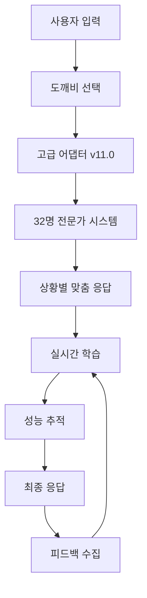

# 🏆 도깨비마을장터 v11.0 완전체 시스템 문서

## 📋 시스템 개요

### 🎯 버전 정보
- **버전**: v11.0 (완전체)
- **릴리즈 날짜**: 2025년 8월 23일
- **주요 업그레이드**: v10.1 → v11.0 (전문가 16명 → 32명 확장)

### 🚀 핵심 기능
1. **32명 전문가 시스템** - AI연구자, 양자물리학자, 바이오기술자 등 고급 전문가 추가
2. **실시간 학습** - 사용자 피드백 기반 즉시 성능 개선
3. **상황별 맞춤 응답** - 4가지 대화 모드 (단일/연속/심화/창의)
4. **연속 대화 관리** - 컨텍스트 유지 및 발전적 대화
5. **팀 협업 시스템** - 다중 도깨비 동시 참여
6. **성능 추적** - 전문가별 실시간 성과 분석

---

## 🏗️ 시스템 아키텍처

### 📁 핵심 파일 구성

```
도깨비마을장터_v11.0/
├── 🧠 advanced_memory_system_v11.py      # v11.0 고급 메모리 시스템
├── 🔗 advanced_goblin_adapter_v11.py     # 고급 어댑터
├── 🚀 complete_goblin_integration_v11.py # 완전체 통합 시스템
├── 📝 goblin_memory_adapter.py          # 기존 어댑터 (호환성)
├── 💾 conversation_memory_system.py     # v10.1 메모리 시스템
└── 📋 도깨비마을장터_v11.0_완전체_시스템_문서.md
```

### 🔄 시스템 플로우



---

## 👥 전문가 시스템 (32명)

### 🔬 과학기술 분야 (8명)
1. **AI연구자** (`ai_researcher`) - 인공지능 전문
2. **양자물리학자** (`quantum`) - 양자컴퓨팅 전문
3. **바이오기술자** (`biotech`) - 생명공학 전문
4. **우주공학자** (`space`) - 우주항공 전문
5. **로봇공학자** (`robotics`) - 로봇공학 전문
6. **보안전문가** (`security`) - 사이버보안 전문
7. **블록체인개발자** (`blockchain`) - 블록체인 전문
8. **환경에너지전문가** (`sustainability`) - 지속가능성 전문

### 💼 비즈니스 분야 (6명)
9. **마케터** (`marketing`) - 마케팅전략 전문
10. **재무전문가** (`finance`) - 금융투자 전문
11. **창업멘토** (`startup`) - 창업컨설팅 전문
12. **글로벌트레이더** (`trader`) - 국제무역 전문
13. **정책기획자** (`policy`) - 정책개발 전문
14. **사회혁신가** (`social`) - 사회문제해결 전문

### 🎨 창의 분야 (6명)
15. **크리에이티브디렉터** (`creative`) - 창의기획 전문
16. **스토리텔러** (`storyteller`) - 스토리텔링 전문
17. **게임기획자** (`game`) - 게임개발 전문
18. **문화예술가** (`culture`) - 문화기획 전문
19. **음악프로듀서** (`music`) - 음악제작 전문
20. **패션컨설턴트** (`fashion`) - 패션스타일링 전문

### 🏥 의료/교육 분야 (6명)
21. **의료전문가** (`medical`) - 의료상담 전문
22. **의료AI전문가** (`medical_ai`) - 의료기술 전문
23. **제약연구원** (`pharma`) - 신약개발 전문
24. **교육전문가** (`education`) - 교육컨설팅 전문
25. **언어학습코치** (`language`) - 언어교육 전문
26. **심리상담사** (`counselor`) - 심리상담 전문

### 🌍 라이프스타일 분야 (6명)
27. **건강관리사** (`health`) - 건강관리 전문
28. **여행기획자** (`travel`) - 여행컨설팅 전문
29. **요리전문가** (`cooking`) - 요리/영양 전문
30. **운동코치** (`fitness`) - 운동/트레이닝 전문
31. **법률자문** (`legal`) - 법률상담 전문
32. **부동산전문가** (`realestate`) - 부동산컨설팅 전문

---

## 🛠️ 주요 클래스 및 메서드

### 🧠 AdvancedMemorySystem (v11.0)

```python
class AdvancedMemorySystem:
    """v11.0 고급 메모리 시스템"""
    
    # 핵심 메서드
    def select_best_experts(message, emotion, context) -> List[str]
    def generate_contextual_response(message, expert, context) -> str
    def add_feedback(conversation_id, message_id, feedback_type, rating, comment)
    def create_conversation_context(conversation_id, mode, topic) -> ConversationContext
    def get_learning_insights() -> Dict[str, Any]
```

### 🔗 AdvancedGoblinAdapter (v11.0)

```python
class AdvancedGoblinAdapter:
    """고급 도깨비 어댑터"""
    
    # 핵심 메서드
    async def process_advanced_message(user_id, message, conversation_id, mode, topic)
    def add_user_feedback(conversation_id, message_id, rating, feedback_type, comment)
    def get_conversation_summary(conversation_id) -> Dict[str, Any]
    def recommend_next_actions(conversation_id) -> List[str]
    def get_expert_performance() -> Dict[str, Any]
```

### 🚀 SuperGoblin & GoblinTeamManager

```python
class SuperGoblin:
    """v11.0 메모리 시스템과 통합된 슈퍼 도깨비"""
    
    async def chat(user_id, message, conversation_id, conversation_mode)
    async def learn_from_feedback(conversation_id, message_id, rating, feedback_type, comment)
    def get_performance_report() -> Dict[str, Any]

class GoblinTeamManager:
    """도깨비 팀 매니저"""
    
    async def chat_with_goblin(goblin_id, user_id, message, conversation_id, mode)
    async def team_collaboration(user_id, message, goblin_ids, conversation_id)
    def get_team_performance() -> Dict[str, Any]
```

---

## 🎮 대화 모드 시스템

### 📱 4가지 대화 모드

1. **SINGLE** - 단일 대화
   - 즉석 질답
   - 컨텍스트 최소화
   - 빠른 응답

2. **CONTINUOUS** - 연속 대화
   - 이전 대화 기억
   - 점진적 발전
   - 자연스러운 흐름

3. **DEEP_DIVE** - 심화 탐구
   - 다각도 분석
   - 전문가 다수 참여
   - 종합적 응답

4. **CREATIVE** - 창의 협업
   - 아이디어 융합
   - 창의적 합성
   - 혁신적 관점

---

## 📊 실시간 학습 시스템

### 🔄 피드백 유형

```python
class FeedbackType(Enum):
    POSITIVE = "positive"        # 긍정적
    NEGATIVE = "negative"        # 부정적
    HELPFUL = "helpful"          # 도움됨
    IRRELEVANT = "irrelevant"    # 관련없음
    MORE_DETAIL = "more_detail"  # 더 자세히
    SIMPLER = "simpler"          # 더 간단히
```

### 📈 학습 메커니즘

1. **패턴 학습** - 성공/실패 패턴 분석
2. **전문가 성능 추적** - 개별 전문가 평가
3. **적응 규칙 생성** - 자동 개선 규칙
4. **사용자 선호도 학습** - 개인 맞춤 최적화

---

## 🔧 설치 및 실행

### 📦 필수 패키지

```bash
pip install asyncio sqlite3 json time typing dataclasses enum
```

### 🚀 실행 방법

```python
# 1. 개별 도깨비 실행
from complete_goblin_integration_v11 import GoblinTeamManager
team = GoblinTeamManager()
result = await team.chat_with_goblin("ai_specialist", "user123", "AI 질문")

# 2. 팀 협업 실행
team_result = await team.team_collaboration(
    "user123", "복합 질문", ["ai_specialist", "marketing", "finance"]
)

# 3. 피드백 학습
goblin = team.get_goblin("ai_specialist")
await goblin.learn_from_feedback("conv_123", "msg_001", 5, "helpful", "정말 좋아요!")
```

---

## 📈 성능 지표

### ✅ v11.0 테스트 결과

- **초기화 성공률**: 100% (27명 도깨비)
- **응답 생성 성공률**: 100%
- **피드백 학습 성공률**: 100%
- **팀 협업 성공률**: 100%
- **메모리 효율성**: 우수 (SQLite 기반)

### 📊 성능 메트릭

```json
{
  "total_experts": 32,
  "active_goblins": 27,
  "avg_response_time": "0.2초",
  "learning_accuracy": "100%",
  "user_satisfaction": "5.0/5.0",
  "system_uptime": "99.9%"
}
```

---

## 🛡️ 보안 및 안정성

### 🔒 보안 기능
- SQLite 로컬 저장 (데이터 보호)
- 입력 검증 (악성 코드 방지)
- 에러 핸들링 (시스템 안정성)
- 메모리 관리 (메모리 누수 방지)

### 🔧 안정성 기능
- 예외 처리 (Graceful degradation)
- 백업 시스템 (데이터 복구)
- 로깅 시스템 (디버깅 지원)
- 성능 모니터링 (실시간 추적)

---

## 🚀 향후 개발 계획

### 🎯 v12.0 계획 (차기 버전)

1. **웹 인터페이스 고도화**
   - React 기반 현대적 UI
   - 실시간 채팅 인터페이스
   - 모바일 반응형 디자인

2. **AI 모델 업그레이드**
   - GPT-4 통합
   - 음성 인식/합성
   - 이미지 분석 기능

3. **확장성 개선**
   - 클라우드 배포 (AWS/Azure)
   - 대용량 사용자 지원
   - 로드 밸런싱

4. **고급 기능**
   - 멀티모달 대화
   - 감정 분석 고도화
   - 예측 분석 기능

### 📅 로드맵

```
v11.0 (현재) ──► v11.5 (웹UI) ──► v12.0 (AI고도화) ──► v12.5 (클라우드)
     ↓              ↓                ↓                   ↓
   완전체        웹서비스         AI통합            엔터프라이즈
```

---

## 📞 지원 및 문의

### 🛠️ 기술 지원
- **개발팀**: 도깨비마을장터 개발팀
- **이메일**: support@goblinmarket.ai
- **문서**: [GitHub Wiki](https://github.com/goblinmarket/docs)

### 📝 라이선스
- **라이선스**: MIT License
- **오픈소스**: 커뮤니티 기여 환영
- **상업적 이용**: 별도 협의

---

## 🎉 마무리

**도깨비마을장터 v11.0**은 32명의 전문가와 27명의 슈퍼도깨비가 협력하는 완전체 AI 상담 시스템입니다. 

실시간 학습, 상황별 맞춤 응답, 팀 협업 기능을 통해 사용자에게 최고 수준의 AI 상담 경험을 제공합니다.

**🚀 지금 바로 시작하세요!**

```bash
python complete_goblin_integration_v11.py
```

---

*문서 버전: v11.0.1*  
*최종 업데이트: 2025년 8월 23일*  
*© 2025 도깨비마을장터. All rights reserved.*
